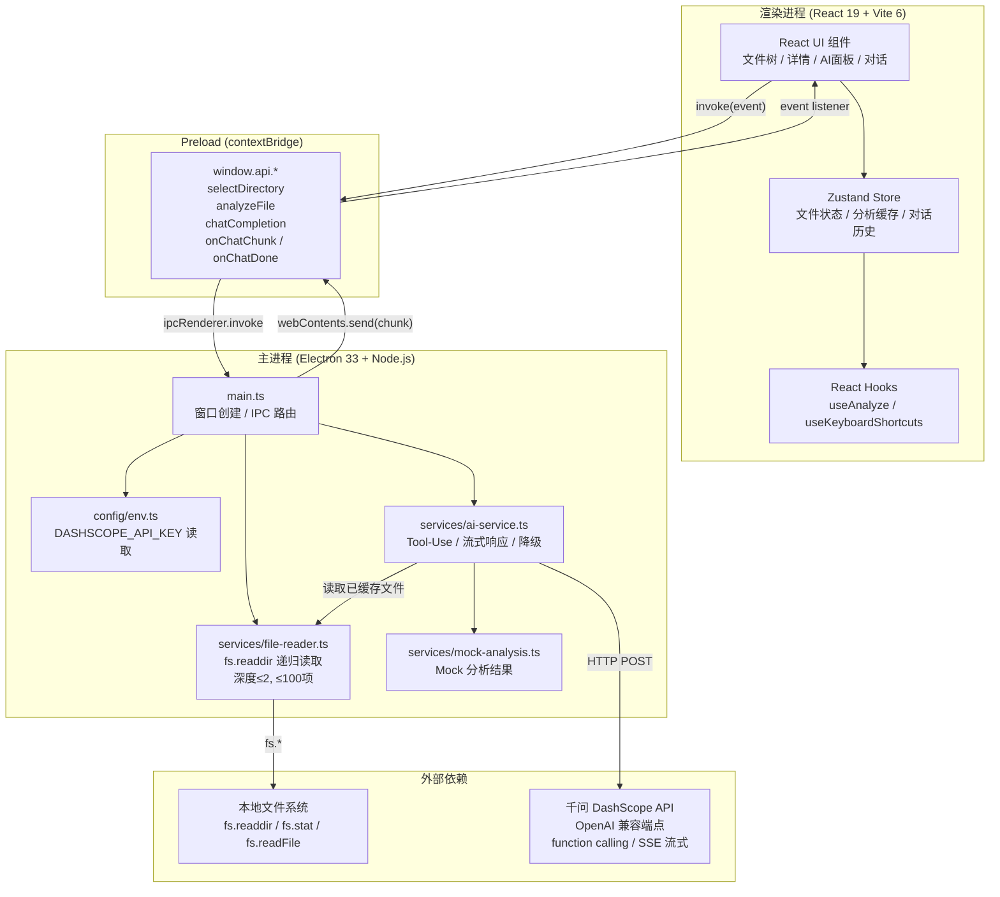

# 夸克 Mini 助手

> 夸克 PC 桌面端 Mini 知识助手 — 基于 Electron 的本地文件 AI 分析与问答应用。

<!-- TODO: 截图 -->
<!--  -->

## 功能特性

- 📁 **本地文件浏览** — 选择本地目录，树形展示文件结构（深度限制2层，最多100项）
- 📄 **文件详情预览** — 元信息 + 文本内容预览（等宽字体，带行号）
- 🤖 **AI 文件分析** — 按文件类型智能分析（代码审查 / 内容摘要 / 数据分析）
- 💬 **AI 对话问答** — 基于文件上下文的多轮对话，流式打字机输出
- 🔧 **Tool-Use 模式** — AI 自主调用工具（read_file / list_files / search_content）
- 🎨 **三栏布局** — 文件树（240px）/ 详情（自适应）/ AI 面板（360px），夸克品牌色设计

## 技术架构



## 技术栈

| 层 | 技术 | 版本 | 选择理由 |
|----|------|------|----------|
| 桌面框架 | Electron | 33 | 打包最成熟，面试场景风险最低 |
| 前端框架 | React + TypeScript | 19 | 生态最强，类型推断最好 |
| 构建工具 | Vite | 6 | 启动快，HMR 热更新 |
| 状态管理 | Zustand | 5 | API 极简（1KB），TS 推断优于 Context |
| AI 服务 | 千问 DashScope | — | OpenAI 兼容端点，function calling 支持 |
| 打包 | electron-builder | 25 | NSIS 安装包，asar 压缩 |

> 详细技术选型对比见 [Proposal](docs/proposal.md#2-技术栈候选对比)。

## 环境要求和运行步骤

### 环境要求

| 软件 | 最低版本 | 推荐版本 |
|------|----------|----------|
| Node.js | 20 | 22+ |
| npm | 10 | 10+ |
| 操作系统 | Windows 10 / macOS 12 / Ubuntu 20 | 有桌面环境的任意系统 |

### 从 clone 到运行

```bash
# 1. 克隆项目
git clone <repo-url>
cd quark-mini-assistant

# 2. 安装依赖
npm install

# 3. 配置 API Key（可选，不配置也可运行，AI 返回 Mock 结果）
cp .env.example .env
# 编辑 .env，填入 DASHSCOPE_API_KEY=your-key-here
# 获取地址：https://bailian.console.aliyun.com/

# 4. 启动开发模式
npm run dev
```

启动后会自动弹出桌面窗口，包含三栏布局：左侧文件树、中间详情、右侧 AI 面板。

### 可用命令

| 命令 | 说明 |
|------|------|
| `npm run dev` | 启动开发模式（Vite + Electron） |
| `npm run dev:all` | 开发模式 + TS watch（修改主进程代码后自动重编译） |
| `npm run build` | 构建生产版本（编译 TS → Vite 打包 → electron-builder） |
| `npx tsc --noEmit` | 仅检查前端 TypeScript 类型 |
| `npx tsc -p tsconfig.node.json --noEmit` | 仅检查主进程 TypeScript 类型 |

## 打包构建

### 各平台构建目标

| 平台 | 格式 | 预计大小 | CI Runner |
|------|------|----------|-----------|
| Windows x64 | NSIS 安装包（.exe） | ~120MB | windows-latest |
| macOS | DMG | ~150MB | macos-latest |
| Linux | AppImage | ~105MB | ubuntu-latest |

### 全平台打包（推荐）

本项目使用 GitHub Actions 自动构建：

```
push → main 分支 或 v* tag
├── windows-latest → NSIS .exe
├── macos-latest   → DMG
└── ubuntu-latest  → AppImage
```

### 本地构建

```bash
# 当前平台
npm run build

# 指定平台（需对应系统环境）
npx electron-builder --win nsis     # Windows（需 Wine 或 Windows 系统）
npx electron-builder --mac dmg      # macOS
npx electron-builder --linux AppImage # Linux
```

> **注意**：Linux 环境无法交叉编译 Windows 安装包，需要 Wine GUI 支持。推荐使用 GitHub Actions 的 `windows-latest` runner。

## 项目结构

```
quark-mini-assistant/
├── electron/                        # Electron 主进程（TypeScript → CommonJS）
│   ├── main.ts                      # 入口：窗口创建 + IPC 路由 + AIService 初始化
│   ├── preload.ts                   # contextBridge：安全暴露 IPC 方法给渲染进程
│   ├── config/
│   │   └── env.ts                   # .env 读取，DASHSCOPE_API_KEY 验证
│   ├── services/
│   │   ├── ai-service.ts            # DashScope API 封装（Tool-Use + 流式 + 降级）
│   │   ├── file-reader.ts           # fs.readdir 递归读取目录（深度≤2, ≤100项）
│   │   └── mock-analysis.ts         # Mock 分析结果（API 失败时降级）
│   └── utils/
│       └── file-classify.ts         # 按扩展名分类：text/code/data/image/binary
├── src/                             # React 渲染进程（TypeScript + Vite）
│   ├── main.tsx                     # React 入口，挂载到 #root
│   ├── App.tsx                      # 根组件：ErrorBoundary + TitleBar + AppLayout
│   ├── components/
│   │   ├── layout/                  # 主布局：三栏分栏 + 自定义标题栏
│   │   ├── file-tree/               # 文件树：递归渲染 + 展开/收起 + 高亮选中
│   │   ├── file-detail/             # 文件详情：元信息 + 代码预览（行号 + 等宽字体）
│   │   ├── ai-panel/                # AI 面板：分析按钮 + 结果卡片 + 对话区 + 调试面板
│   │   └── shared/                  # 通用组件：EmptyState / LoadingSpinner / ErrorFallback
│   ├── store/
│   │   └── index.ts                 # Zustand Store：文件状态 + AI 分析 + 对话历史
│   ├── hooks/
│   │   ├── useAnalyze.ts            # AI 分析 hook（缓存检查 → API 调用 → 结果缓存）
│   │   └── useKeyboardShortcuts.ts  # 全局快捷键（Ctrl+O 打开文件夹）
│   ├── utils/
│   │   ├── format.ts                # 文件大小 / 日期格式化
│   │   └── file-icon.ts             # 文件类型 → emoji 映射
│   ├── api/
│   │   └── index.ts                 # window.api 的 TypeScript 类型声明
│   └── types/
│       └── index.ts                 # 全局类型：FileNode / AnalysisResult / ChatMessage
├── docs/                            # OpenSpec 文档
│   ├── proposal.md                  # 产品方向分析 + 技术栈对比
│   ├── specs.md                     # 功能规格 + 验收标准
│   ├── design.md                    # 系统架构 + 数据模型 + 技术决策
│   └── tasks.md                     # 14个任务拆分（P0/P1 优先级）
├── devlog/
│   └── DEVLOG.md                    # 开发日志（每个阶段的决策/问题/待确认）
├── .github/workflows/
│   └── build.yml                    # GitHub Actions 全平台 CI
├── build/
│   └── icon.png                     # 应用图标（256x256 PNG）
├── package.json
├── tsconfig.json                    # React 端 TS 配置（strict 模式）
├── tsconfig.node.json               # Node.js 端 TS 配置（CommonJS 输出）
├── vite.config.ts                   # Vite 构建配置
├── electron-builder.json            # 打包配置
├── .env.example                     # 环境变量模板（.env 在 .gitignore 中）
├── .gitignore
├── CLAUDE.md                        # Claude Code 项目指令
└── README.md                        # 本文件
```

## 技术决策摘要

核心决策见 [DEVLOG](devlog/DEVLOG.md)。以下是最重要的 5 个：

| # | 决策 | 选择 | 理由 |
|---|------|------|------|
| 1 | AI 调用模式 | Tool-Use（Function Calling） | 参考 MCP 理念，模型自主选择工具，展示效果好 |
| 2 | 文件读取 | 主进程 fs.readdir 递归 | 真实文件操作比 Mock JSON 更能体现端侧能力 |
| 3 | 状态管理 | Zustand | API 极简（create() 一个函数），1KB 体积 |
| 4 | 桌面框架 | Electron（而非 Tauri） | 打包最成熟，面试场景风险最低 |
| 5 | 错误降级 | 三层（真实API → Mock → 静态兜底） | 确保 Demo 展示不中断，评审无白屏 |

## 开发模式

本项目遵循 **OpenSpec** 流程：

```
proposal → specs → design → tasks → 实现
```

每个阶段的产出存放在 `/docs` 目录下。开发决策和权衡记录在 `/devlog/DEVLOG.md` 中。

## License

Copyright © 2026 Quark
